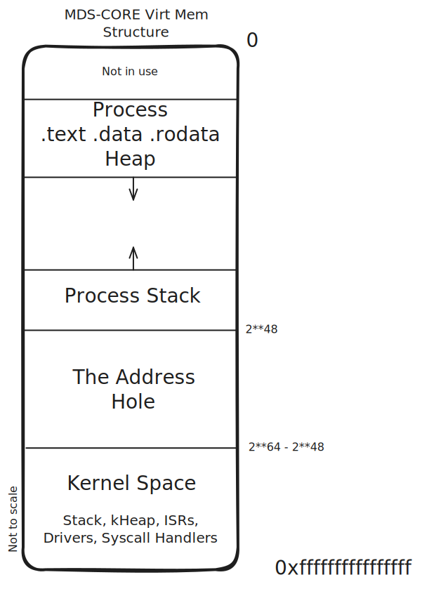
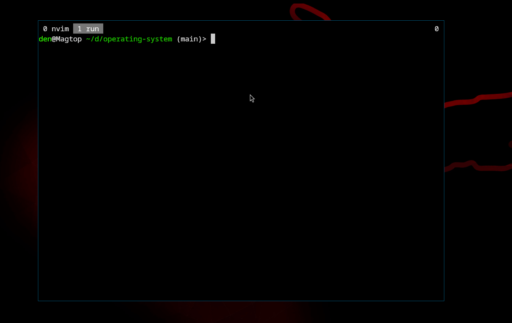

# Operating System

Currently WIP. Supported and implemented features up to 2024-12-14 include (all custom implementations and are by us):
- 2 Stage bootloader with:
    - Dynamic physical address allocator
    - Long mode (64 bit)
    - MMU/Paging
    - Dynamic Kernel loader (with kernel-swapping)
- Drivers:
    - HDD/IDE drivers
    - VGA256 drivers
    - Keyboard drivers
- FAT16 filesystem
- Kernel `ptmalloc` implementation + `mmap`/`munmap`
- Image/Video rendering
- Partial libc (printf, FILE, mem/str, sin/cos ...)
- Precise clock & Date clock
- Interrupts + IRQ handling
- SSE (FPU) support
- Usermode (ring 3):
    - ELF loading
    - System calls (via `syscall`)
    - SMEP & SMAP
    - Multitasking of processes
    - Scheduler

### Virtual Memory Structure
We took inspiration from Linux and mapped the kernel space in the non-canonical
addresses, while keeping all the Process-related data in canonical memory. \
We put the usermode stack right bellow the address hole, and the process data
(.text, .rodata, .data, heap, ...) are loaded at a dynamic address, based on the
ELF being run, keeping `NULL` not a valid address. Like so:
<details>
  <summary>[Click to show]</summary>

</details>

## Demo
#### The following video contains a technical demonstration of the current visual features of the OS:


Note that features like glibc-style ptmalloc, MMU, long mode and others, exist and are are used in the demo above, but aren't visible directly.

## Building

You will need `wget`, `mtools`, `direnv` and Make (best GNUmake) installed. \
First, (after cloning the project) install the buildtools with
```sh
make toolchain
```
After that, compile the bootloader and the kernel with
```sh
make
```

## Running

The compiled OS will appear in `hdd.img`, which contains both the bootloader
and the kernel. \
You can run the OS on any x86-64 system as long as it has BIOS support. \
One example (except running on bare metal) would be using qemu:
```sh
qemu-system-x86_64 -hda hdd.img
```

To both build and run with qemu you can use
```sh
make run
```
